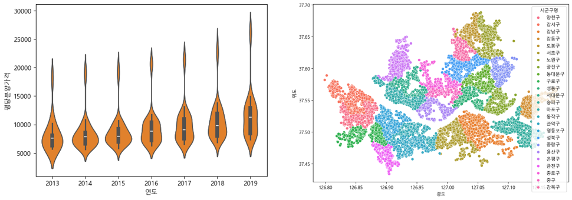

# 공공데이터 분석 실습 (pandas · seaborn)

박조은 님의 인프런 강의 **「공공데이터로 파이썬 데이터 분석 시작하기」** 를 따라 하며, 강의에서 제공하는 빈칸 실습 노트북(`-input`)에 직접 코드를 채워 넣은 실습 기록입니다. 공공데이터를 불러와 전처리 · 집계 · 시각화하는 pandas와 seaborn 사용법을 익히는 것이 목적입니다.

- 강의 실습 코드 원본: [corazzon/open-data-analysis-basic](https://github.com/corazzon/open-data-analysis-basic)

<p align="center"></p>
<p align="center"><sub>왼쪽: 연도별 평당분양가격 분포 (violinplot) · 오른쪽: 서울 학원 위치를 구별 색으로 표시 (scatterplot)</sub></p>

## 노트북 구성

| 노트북 | 데이터 | 실습 내용 |
|---|---|---|
| `01-apt-price-input.ipynb` | 주택도시보증공사 전국 평균 분양가격 (2013년 9월~2019년 12월) | 결측치 확인, 문자열 → 숫자 변환, 평당분양가격 계산, 규모구분 → 전용면적 정리 · `groupby` · `pivot_table` 집계 · 2015년 이전 데이터를 `melt`로 Tidy data로 바꾼 뒤 `concat`으로 합치기 · 선 · 막대 · 박스 · 바이올린 · 스웜 · 히트맵 등으로 지역별 · 연도별 분양가 비교 |
| `02-store-eda-input.ipynb` | 소상공인시장진흥공단 상가업소정보 (2019년 12월) | 결측치 시각화와 불필요한 컬럼 제거, `loc` · `iloc` 인덱싱, 기술통계와 상관계수 · 범주형 변수 빈도 · 조건 필터와 `isin`으로 서브셋 만들기, 구별 음식점 · 학원 수 비교, `unstack` · 위경도 산점도 |

## 실행 방법

```bash
pip install pandas numpy matplotlib seaborn
```

- 데이터 파일은 용량 문제로 포함하지 않았습니다. 강의 저장소 안내에 따라 공공데이터포털에서 받을 수 있습니다.
- 노트북의 파일 경로는 제 PC의 로컬 경로이므로, 받은 데이터 위치에 맞게 바꿔야 합니다.
- 한글 그래프를 위해 `Malgun Gothic` 폰트를 설정했습니다 (Windows 기준).

## 배운 점

- 공공데이터는 숫자 컬럼에 공백 · 문자가 섞여 있는 경우가 많아, 분석 전에 타입 변환과 결측치 처리가 먼저 필요하다는 점
- 같은 집계를 `groupby`와 `pivot_table` 두 방식으로 해 보며, 넓은 형태(wide)와 긴 형태(long, `melt`) 데이터의 차이를 이해
- 평균만 보는 막대그래프와 분포를 보여 주는 박스 · 바이올린 그래프가 같은 데이터에서 다른 정보를 준다는 점
